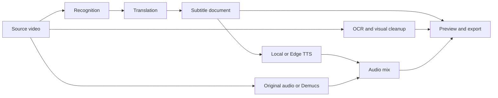

<div align="center">
  
  <h1>HaizFlow</h1>
  <p><strong>Local-first video translation and dubbing for Windows.</strong></p>
  <p>Transcribe, translate, create subtitles, synthesize speech, mix audio, and export without a paid inference API.</p>

  <p>
    <a href="LICENSE"></a>
    <a href="https://github.com/MachHongHai/HaizFlow"></a>
    <a href="https://www.python.org/"></a>
    
  </p>

  <p>
    <a href="https://github.com/MachHongHai/HaizFlow"><strong>Source code</strong></a> ·
    <a href="https://github.com/MachHongHai/HaizFlow/issues"><strong>Report an issue</strong></a> ·
    <a href="https://www.linkedin.com/in/machhonghai/"><strong>LinkedIn</strong></a> ·
    <a href="mailto:machhonghaipr@gmail.com"><strong>Email</strong></a>
  </p>

  <p><strong>English</strong> · <a href="README.vi.md">Tiếng Việt</a></p>
</div>

---

## Why HaizFlow

Video localization commonly requires several subscriptions, manual file transfers, and a browser-based editor. HaizFlow brings the working set into one Windows desktop application and keeps project media on storage you control.

- **No paid inference API is required for the core workflow.** Whisper/WhisperX, HY-MT2, OmniVoice, Demucs, OCR, and FFmpeg run locally after their verified assets are installed.
- **Your project remains local.** Source media, intermediate artifacts, settings, previews, and exports are stored in project-owned directories.
- **Automatic and manual workflows coexist.** Run an end-to-end job when speed matters, or edit independent layers when control matters.
- **Expensive work is reusable.** Content-addressed caches avoid repeating recognition, translation, separation, visual cleanup, or speech synthesis when inputs have not changed.
- **The application is inspectable.** Source code is Apache-2.0, technical logs are available on demand, and model/download boundaries are documented.

> [!IMPORTANT]
> HaizFlow is under active development. Keep a copy of irreplaceable source media and review the [release-readiness document](docs/release-readiness.md) before distributing a build.

## What it can do

| Workspace | Purpose |
| --- | --- |
| **Automatic** | Configure one video and run recognition, translation, subtitles, speech, audio, and export as a managed job. |
| **Manual editor** | Work non-linearly with source audio, recognition and translation, subtitle layout, visual cleanup, speech, audio mix, and export. |
| **Batch** | Apply the shared processing configuration to several videos while retaining per-video status and recovery. |
| **Downloads** | Import a video, channel, or audio source from a supported public link into a managed project. |
| **Social publishing** | Prepare and publish finished media through a user-configured Zernio connection. |

Manual editing is layer-oriented. A translated subtitle can be displayed before OCR cleanup or speech exists; image cleanup, voice generation, music, levels, watermark, and subtitle timing can be changed independently. Export uses the current valid state instead of forcing every optional tool to run.

## Processing model



Only the dependency needed by a command is evaluated. In the Manual editor, changing subtitle timing does not rerun TTS; changing volume does not rerun translation; switching between cached visual modes does not rerun OCR.

## Quick start from source

### Requirements

- Windows 10 version 1809 or later, or Windows 11, x64.
- Python 3.13 x64.
- Git and PowerShell.
- Sufficient free disk space for the application, models, project media, and caches.
- An NVIDIA GPU is recommended for larger local models; supported CPU paths remain available where documented.

### Install

```powershell
git clone https://github.com/MachHongHai/HaizFlow.git
cd HaizFlow
powershell -ExecutionPolicy Bypass -File .\scripts\install-desktop-env.ps1
```

The installation script creates `.venv`, synchronizes the hash-locked Windows dependency set, verifies the runtime, and installs the repository in editable mode.

### Run

```powershell
.\.venv\Scripts\python.exe .\haizflow_desktop.py
```

On first use, HaizFlow may need an Internet connection to download selected model assets. Downloads are checked against fixed size and SHA-256 metadata before they are activated. Once installed, the core local pipeline can run without a paid API.

### Verify a development checkout

```powershell
.\scripts\test.ps1
```

This runs Python compilation, correctness linting, the unit/integration suite, and `qmllint`.

## First project

1. Open **Projects** and choose **New project**.
2. Select **Automatic** for a managed end-to-end run, **Manual** for independent tools, or **Batch** for multiple videos.
3. Import a local video or a supported public link.
4. Choose the source and target language, recognition model, voice, subtitle treatment, and audio behavior relevant to the selected workspace.
5. Start the named operation. Progress appears beside the active tool and in the activity strip.
6. Review the preview and subtitles. Manual projects allow direct text, timing, position, size, image, voice, and audio adjustments.
7. Export the current result and open the output from the project workspace.

For every control and recovery path, read the [English user guide](docs/user-guide.md) or [Vietnamese user guide](docs/user-guide.vi.md).

## Network and privacy

The local workflow does not upload project video to a HaizFlow server; HaizFlow has no hosted processing backend. Network access is used only by features that inherently require it:

- first-run downloads of verified model assets;
- public URL and channel inspection/download;
- Edge TTS when that provider is selected;
- Zernio authentication, upload, and social publishing.

Credentials are stored through Windows Credential Manager. Diagnostic export is bounded and redacted and does not include project media. See [Architecture: network and privacy boundary](docs/architecture.md#10-network-and-privacy-boundary).

## Documentation

| Document | Audience | Description |
| --- | --- | --- |
| [User guide](docs/user-guide.md) · [Tiếng Việt](docs/user-guide.vi.md) | Users | Installation, projects, editing, download, publishing, storage, and troubleshooting. |
| [Architecture](docs/architecture.md) · [Tiếng Việt](docs/architecture.vi.md) | Engineers | Layer boundaries, persistence, artifact graph, concurrency, preview, and trust model. |
| [Development guide](docs/development.md) · [Tiếng Việt](docs/development.vi.md) | Contributors | Environment setup, tests, code conventions, and change workflow. |
| [Dependency security](docs/dependency-security.md) · [Tiếng Việt](docs/dependency-security.vi.md) | Security and release reviewers | Dependency audit policy, controlled exceptions, and model trust boundaries. |
| [Release readiness](docs/release-readiness.md) · [Tiếng Việt](docs/release-readiness.vi.md) | Maintainers | Packaging, legal, installer, verification, and production gates. |

## Technology

- **Desktop:** Python 3.13, PySide6, Qt Quick/QML
- **Recognition:** WhisperX, faster-whisper, CTranslate2
- **Translation:** HY-MT2
- **Speech:** OmniVoice locally; Edge TTS as an optional online provider
- **Audio:** Demucs, PyDub, SoundFile
- **Visual processing:** RapidOCR, FFmpeg, libass-compatible subtitle rendering
- **Acquisition:** yt-dlp with bounded retry, validation, and project-owned staging

The detailed dependency direction and worker model are documented in [docs/architecture.md](docs/architecture.md).

## Contributing

Issues and focused pull requests are welcome. Before changing persisted data, cache signatures, model loading, or the QML/controller boundary, read the [development guide](docs/development.md) and [architecture](docs/architecture.md).

```powershell
.\scripts\test.ps1
```

A contribution should leave the existing workflow operational, include regression coverage for behavior changes, preserve user-owned files, and avoid silently introducing a new network or model trust boundary.

## License and third-party components

HaizFlow source code is licensed under the [Apache License 2.0](LICENSE). Downloaded or bundled models, fonts, codecs, and libraries remain under their respective licenses. In particular, the OmniVoice SDK and its model checkpoint do not share identical licensing terms; review [NOTICE](NOTICE), the [`licenses`](licenses) directory, and the [release gate](docs/release-readiness.md) before redistribution or commercial use.

## Developer

HaizFlow is developed by **Mạch Hồng Hải**.

<p>
  <a href="https://github.com/MachHongHai"></a>
  <a href="https://www.linkedin.com/in/machhonghai/"></a>
  <a href="mailto:machhonghaipr@gmail.com"></a>
</p>

If HaizFlow is useful to you, consider [starring the repository](https://github.com/MachHongHai/HaizFlow) or opening a precise issue with reproduction steps.
