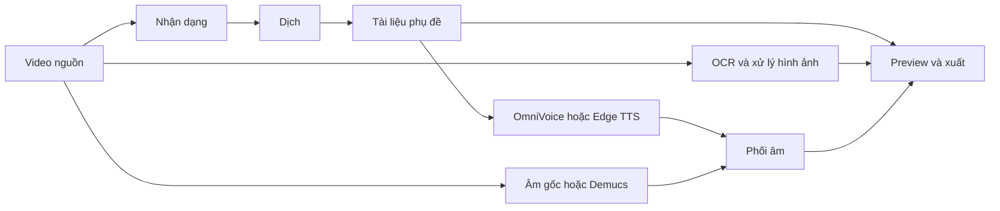

<div align="center">
  
  <h1>HaizFlow</h1>
  <p><strong>Dịch và lồng tiếng video theo hướng local-first trên Windows.</strong></p>
  <p>Nhận dạng, dịch, tạo phụ đề, tổng hợp giọng nói, phối âm và xuất video mà không cần API suy luận trả phí.</p>

  <p>
    <a href="LICENSE"></a>
    <a href="https://github.com/MachHongHai/HaizFlow"></a>
    <a href="https://www.python.org/"></a>
    
  </p>

  <p>
    <a href="https://github.com/MachHongHai/HaizFlow"><strong>Mã nguồn</strong></a> ·
    <a href="https://github.com/MachHongHai/HaizFlow/issues"><strong>Báo lỗi</strong></a> ·
    <a href="https://www.linkedin.com/in/machhonghai/"><strong>LinkedIn</strong></a> ·
    <a href="mailto:machhonghaipr@gmail.com"><strong>Email</strong></a>
  </p>

  <p><a href="README.md">English</a> · <strong>Tiếng Việt</strong></p>
</div>

---

## Vì sao có HaizFlow

Một quy trình bản địa hóa video thường phải dùng nhiều dịch vụ trả phí, chuyển tệp qua nhiều công cụ và chỉnh sửa trên trình duyệt. HaizFlow gom các công việc cần thiết vào một ứng dụng Windows và lưu dữ liệu dự án trên bộ nhớ do bạn kiểm soát.

- **Quy trình cốt lõi không cần API suy luận trả phí.** Whisper/WhisperX, HY-MT2, OmniVoice, Demucs, OCR và FFmpeg chạy trên máy sau khi cài đủ asset đã xác minh.
- **Dữ liệu dự án thuộc về bạn.** Video nguồn, artifact trung gian, thiết lập, preview và video xuất nằm trong thư mục dự án cục bộ.
- **Có cả chế độ nhanh và chế độ kiểm soát sâu.** Dùng Tự động khi cần xử lý trọn luồng hoặc Thủ công khi muốn chỉnh từng lớp độc lập.
- **Không lặp lại tác vụ nặng nếu không cần.** Cache theo nội dung tái sử dụng kết quả nhận dạng, dịch, tách giọng, xử lý hình ảnh và TTS còn hợp lệ.
- **Có thể kiểm tra và chẩn đoán.** Mã nguồn dùng Apache-2.0, log kỹ thuật mở theo nhu cầu và ranh giới mạng/model được tài liệu hóa.

> [!IMPORTANT]
> HaizFlow đang được phát triển tích cực. Hãy giữ bản sao video nguồn quan trọng và đọc [tiêu chuẩn sẵn sàng phát hành](docs/release-readiness.vi.md) trước khi phân phối một bản build.

## Các không gian làm việc

| Không gian | Mục đích |
| --- | --- |
| **Tự động** | Cấu hình một video và chạy nhận dạng, dịch, phụ đề, giọng, âm thanh và xuất dưới dạng một công việc được quản lý. |
| **Trình sửa Thủ công** | Làm việc phi tuyến với nguồn, nhận dạng và dịch, phụ đề, hình ảnh, giọng đọc, phối âm và xuất. |
| **Hàng loạt** | Áp dụng cấu hình chung cho nhiều video nhưng vẫn giữ trạng thái và khả năng phục hồi riêng cho từng video. |
| **Tải xuống** | Nhập video, kênh hoặc âm thanh từ liên kết công khai được hỗ trợ vào dự án có quản lý. |
| **Đăng mạng xã hội** | Chuẩn bị và đăng video hoàn tất qua kết nối Zernio do người dùng cấu hình. |

Trình sửa Thủ công hoạt động theo lớp, không ép đi theo từng bước. Phụ đề dịch có thể xuất hiện trước khi OCR hoặc giọng đọc tồn tại; che phụ đề gốc, TTS, nhạc, âm lượng, watermark và timing được chỉnh độc lập. Khi xuất, HaizFlow dùng trạng thái hợp lệ hiện tại thay vì bắt buộc chạy đủ mọi công cụ.

## Mô hình xử lý



Mỗi lệnh chỉ đánh giá dependency cần thiết. Trong trình sửa Thủ công, đổi timing không chạy lại TTS; đổi âm lượng không chạy lại dịch; quay về chế độ hình ảnh đã có cache không chạy lại OCR.

## Bắt đầu từ mã nguồn

### Yêu cầu

- Windows 10 phiên bản 1809 trở lên hoặc Windows 11 x64.
- Python 3.13 x64.
- Git và PowerShell.
- Đủ dung lượng cho ứng dụng, model, video dự án và cache.
- Nên có GPU NVIDIA khi dùng model local lớn; những đường chạy CPU được hỗ trợ vẫn có thể dùng theo tài liệu.

### Cài đặt

```powershell
git clone https://github.com/MachHongHai/HaizFlow.git
cd HaizFlow
powershell -ExecutionPolicy Bypass -File .\scripts\install-desktop-env.ps1
```

Script tạo `.venv`, đồng bộ bộ dependency Windows đã khóa hash, kiểm tra runtime và cài repository ở chế độ editable.

### Chạy ứng dụng

```powershell
.\.venv\Scripts\python.exe .\haizflow_desktop.py
```

Lần đầu dùng một số tính năng, HaizFlow cần Internet để tải asset model. Tệp tải về được đối chiếu kích thước và SHA-256 trước khi kích hoạt. Sau khi cài đủ model, quy trình local cốt lõi không cần API trả phí.

### Kiểm tra source phát triển

```powershell
.\scripts\test.ps1
```

Lệnh này chạy compile Python, correctness lint, unit/integration test và `qmllint`.

## Tạo dự án đầu tiên

1. Mở **Dự án** và chọn **Dự án mới**.
2. Chọn **Tự động** cho luồng xử lý trọn gói, **Thủ công** cho các công cụ độc lập hoặc **Hàng loạt** cho nhiều video.
3. Nhập video từ tệp cục bộ hoặc một liên kết công khai được hỗ trợ.
4. Chọn ngôn ngữ nguồn/đích, model nhận dạng, giọng đọc, cách xử lý phụ đề gốc và âm thanh phù hợp.
5. Chạy đúng tác vụ cần dùng. Tiến trình xuất hiện tại công cụ đang chạy và thanh hoạt động.
6. Kiểm tra preview và phụ đề. Dự án Thủ công cho phép chỉnh text, timing, vị trí, kích thước, hình ảnh, giọng và âm thanh.
7. Xuất trạng thái hiện tại rồi mở video từ không gian dự án.

Đọc [hướng dẫn sử dụng tiếng Việt](docs/user-guide.vi.md) để xem đầy đủ từng màn hình và cách xử lý lỗi.

## Mạng và quyền riêng tư

Quy trình local không tải video dự án lên máy chủ HaizFlow; HaizFlow không có backend xử lý được lưu trữ. Mạng chỉ được dùng cho tính năng vốn cần kết nối:

- tải model đã xác minh ở lần đầu;
- kiểm tra và tải video/kênh từ URL công khai;
- Edge TTS khi người dùng chọn provider này;
- đăng nhập, tải lên và đăng mạng xã hội qua Zernio.

Credential được lưu bằng Windows Credential Manager. Gói chẩn đoán được giới hạn và lọc dữ liệu nhạy cảm, không chứa media dự án. Xem [ranh giới mạng và quyền riêng tư](docs/architecture.vi.md#10-ranh-giới-mạng-và-quyền-riêng-tư).

## Tài liệu

| Tài liệu | Dành cho | Nội dung |
| --- | --- | --- |
| [Hướng dẫn sử dụng](docs/user-guide.vi.md) · [English](docs/user-guide.md) | Người dùng | Cài đặt, dự án, chỉnh sửa, tải xuống, đăng bài, lưu trữ và xử lý lỗi. |
| [Kiến trúc](docs/architecture.vi.md) · [English](docs/architecture.md) | Kỹ sư | Phân lớp, persistence, artifact graph, concurrency, preview và trust model. |
| [Hướng dẫn phát triển](docs/development.vi.md) · [English](docs/development.md) | Người đóng góp | Môi trường, test, quy ước code và quy trình thay đổi. |
| [An toàn dependency](docs/dependency-security.vi.md) · [English](docs/dependency-security.md) | Người duyệt security/release | Audit dependency, ngoại lệ có kiểm soát và ranh giới tin cậy model. |
| [Sẵn sàng phát hành](docs/release-readiness.vi.md) · [English](docs/release-readiness.md) | Maintainer | Đóng gói, pháp lý, installer, kiểm chứng và điều kiện production. |

## Công nghệ

- **Desktop:** Python 3.13, PySide6, Qt Quick/QML
- **Nhận dạng:** WhisperX, faster-whisper, CTranslate2
- **Dịch:** HY-MT2
- **Giọng đọc:** OmniVoice local; Edge TTS online tùy chọn
- **Âm thanh:** Demucs, PyDub, SoundFile
- **Hình ảnh:** RapidOCR, FFmpeg, renderer phụ đề tương thích libass
- **Nhập nội dung:** yt-dlp với retry có giới hạn, validation và staging thuộc dự án

## Đóng góp

Bạn có thể mở issue hoặc gửi pull request có phạm vi rõ. Trước khi thay đổi dữ liệu lưu, cache signature, model loader hoặc ranh giới QML/controller, hãy đọc [hướng dẫn phát triển](docs/development.vi.md) và [tài liệu kiến trúc](docs/architecture.vi.md).

Mọi thay đổi cần giữ luồng hiện tại hoạt động, có regression test cho hành vi mới, bảo vệ tệp của người dùng và không âm thầm thêm một ranh giới mạng/model mới.

## Giấy phép và thành phần bên thứ ba

Mã nguồn HaizFlow dùng [Apache License 2.0](LICENSE). Model, font, codec và thư viện được tải hoặc đóng gói vẫn tuân theo giấy phép riêng. Đặc biệt, OmniVoice SDK và checkpoint model không dùng cùng điều khoản; cần đọc [NOTICE](NOTICE), thư mục [`licenses`](licenses) và [release gate](docs/release-readiness.vi.md) trước khi phân phối hoặc sử dụng thương mại.

## Nhà phát triển

HaizFlow được phát triển bởi **Mạch Hồng Hải**.

<p>
  <a href="https://github.com/MachHongHai"></a>
  <a href="https://www.linkedin.com/in/machhonghai/"></a>
  <a href="mailto:machhonghaipr@gmail.com"></a>
</p>

Nếu HaizFlow hữu ích, bạn có thể [tặng repository một sao](https://github.com/MachHongHai/HaizFlow) hoặc mở issue kèm các bước tái hiện cụ thể.
