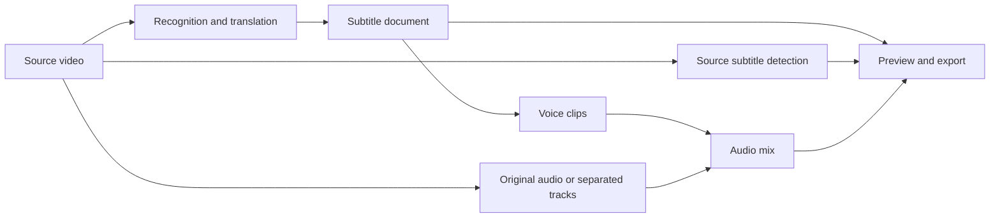

<div align="center">
  
  <h1>HaizFlow</h1>
  <p><strong>Free video translation, dubbing and finishing tools for Windows.</strong></p>
  <p>Work with subtitles, speech, picture and sound in one desktop application. Local engines do not require a paid inference API.</p>

  <p>
    <a href="LICENSE"></a>
    
    
    
  </p>

  <p>
    <a href="https://github.com/MachHongHai/HaizFlow"><strong>Source</strong></a> ·
    <a href="docs/user-guide.md"><strong>User guide</strong></a> ·
    <a href="https://github.com/MachHongHai/HaizFlow/issues"><strong>Issues</strong></a> ·
    <a href="README.vi.md"><strong>Tiếng Việt</strong></a>
  </p>
</div>

---

## About HaizFlow

HaizFlow is a Windows application for translating and finishing video. It combines transcription, translation, subtitle editing, speech synthesis, audio mixing, source-subtitle removal and export without sending the core job through a paid inference API.

Whisper, HY-MT2, OmniVoice, Demucs and OCR can run on the user's computer after the corresponding resource packs are installed. Projects, working files and exports remain in directories controlled by the user. Features that depend on an outside service—such as Edge TTS, importing a public URL and social publishing—still require an Internet connection.

The project is under active development. Keep a separate copy of source material that cannot be replaced, and consult [release readiness](docs/release-readiness.md) before distributing a build.

## Main features

| Area | What it is for |
| --- | --- |
| **Automatic** | Configure one video and let HaizFlow perform the selected operations in order. Jobs can be paused and resumed. |
| **Manual editor** | Edit subtitles, picture, voice and sound independently, in any order. Export uses the current edit. |
| **Batch** | Apply one configuration to several videos while keeping separate progress and errors for each file. |
| **Downloads** | Save supported public video, channel or audio links as managed projects. |
| **Social publishing** | Prepare and submit finished videos through a Zernio account supplied by the user. |

The Manual editor does not force every tool to run. Translated text can appear before source subtitles are concealed or a voice is generated. Changing volume does not translate the video again; changing subtitle timing does not synthesize the voice again; returning to a previously processed visual option reuses its saved result when it is still valid.

## Install from source

### Requirements

- Windows 10 version 1809 or later, or Windows 11, x64.
- Python 3.13 x64, Git and PowerShell.
- 16 GiB RAM or more.
- An NVIDIA GPU is optional. Larger local models run faster on a compatible GPU; supported CPU modes remain available.
- Enough free space for the Core application, the resource packs you choose, project media and exports.

The current verified Core artifact is 477 MiB. Setup recommends 4 GiB of free space and calculates the exact minimum from the build being installed. Optional engines, models, project media and exports are measured separately; they are not hidden inside the Core requirement.

### Set up a development checkout

```powershell
git clone https://github.com/MachHongHai/HaizFlow.git
cd HaizFlow
powershell -ExecutionPolicy Bypass -File .\scripts\install-desktop-env.ps1
```

### Start the application

```powershell
.\.venv\Scripts\python.exe .\haizflow_desktop.py
```

Open **Settings → Resource packs** to install the local engines and models you intend to use. Downloads can resume after interruption and are checked against their published size and SHA-256 digest before activation.

HaizFlow opens the Home page before starting model preparation. When **Keep models ready** is enabled, installed models that are likely to be needed are loaded in a separate worker after the interface is responsive. A processing command always takes priority over background preparation.

### Run the checks

```powershell
.\scripts\test.ps1
```

This command compiles the Python source, runs the automated test suite and checks the QML files.

## A first project

1. Open **Projects** and select **New project**.
2. Choose **Automatic**, **Manual** or **Batch**.
3. Import a local video or a supported public link.
4. Select the languages and only the options needed for this job.
5. Run the required command and follow its progress beside the active tool.
6. Review the result. In a Manual project, subtitles, picture, voice and sound can be revised separately.
7. Select **Export video**, then play the finished file or open its folder.

The [user guide](docs/user-guide.md) explains every project type, the Manual editor, resource packs, storage and common recovery steps. A complete [Vietnamese guide](docs/user-guide.vi.md) is also available.

## Manual editing model



Each command performs the operation named by its tool. Saved results are identified by their inputs and settings, so changing one layer does not discard unrelated work. Export does not run missing optional tools automatically; it renders the valid state currently shown by the editor.

## Network use and privacy

HaizFlow does not operate a hosted video-processing service. Local engines read project media from the user's storage. Network access is limited to features that need it:

- downloading resource packs after confirmation;
- inspecting or downloading a public URL or channel;
- sending subtitle text to Edge TTS when that voice provider is selected;
- authenticating, uploading and publishing through Zernio.

Credentials are stored with Windows Credential Manager. Diagnostic exports exclude project media and redact known secret fields. The exact boundary is described in [Architecture: network and privacy](docs/architecture.md#10-network-and-privacy-boundary).

## Documentation

| Document | Intended reader | Contents |
| --- | --- | --- |
| [User guide](docs/user-guide.md) · [Tiếng Việt](docs/user-guide.vi.md) | Users and testers | Installation, projects, editing, downloads, publishing and troubleshooting. |
| [Architecture](docs/architecture.md) · [Tiếng Việt](docs/architecture.vi.md) | Engineers | Process boundaries, persistence, caches, concurrency and security. |
| [Development](docs/development.md) · [Tiếng Việt](docs/development.vi.md) | Contributors | Environment setup, tests, source conventions and review requirements. |
| [Dependency security](docs/dependency-security.md) · [Tiếng Việt](docs/dependency-security.vi.md) | Security reviewers | Pinned dependencies, advisories, mitigations and model trust. |
| [Release readiness](docs/release-readiness.md) · [Tiếng Việt](docs/release-readiness.vi.md) | Maintainers | Build, installer, licensing and release gates. |
| [Contributing](CONTRIBUTING.md) · [Tiếng Việt](CONTRIBUTING.vi.md) | Contributors | How to propose, test and document a change. |
| [Security policy](SECURITY.md) · [Tiếng Việt](SECURITY.vi.md) | Security reporters | Supported releases and private reporting. |

## Technical overview

- **Application:** Python 3.13, PySide6 and Qt Quick/QML.
- **Recognition:** WhisperX, faster-whisper and CTranslate2.
- **Translation:** HY-MT2.
- **Speech:** OmniVoice locally; Edge TTS as an online option.
- **Audio:** Demucs, FFmpeg, PyDub and SoundFile.
- **Picture and subtitles:** RapidOCR, FFmpeg and libass-compatible rendering.
- **Public media import:** yt-dlp with validation and bounded retry.

The Core application and AI engines are packaged separately. Engines run outside the interface process through a versioned protocol, keeping large inference libraries out of application startup and preventing their DLLs from changing the Qt runtime.

## Contributing

Focused issues and pull requests are welcome. Changes to saved project data, cache keys, model loading or the QML/controller interface should include a regression test and a corresponding documentation update. Start with the [development guide](docs/development.md) and [architecture](docs/architecture.md).

## License

HaizFlow source code is available under the [Apache License 2.0](LICENSE). Models, fonts, codecs and third-party libraries retain their own licenses. The OmniVoice SDK and its model checkpoint, in particular, do not have identical licensing terms. Review [NOTICE](NOTICE), [`licenses`](licenses) and [release readiness](docs/release-readiness.md) before redistribution or commercial use.

## Developer

HaizFlow is developed and maintained by **Mạch Hồng Hải**.

<p>
  <a href="https://github.com/MachHongHai"></a>
  <a href="https://www.linkedin.com/in/machhonghai/"></a>
  <a href="mailto:machhonghaipr@gmail.com"></a>
</p>

If HaizFlow has been useful, you can [star the repository](https://github.com/MachHongHai/HaizFlow) or help improve it by filing a concise issue with reproduction steps.
