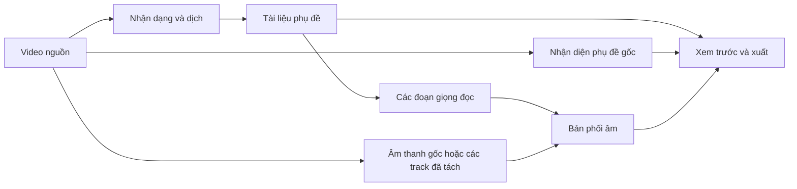

<div align="center">
  
  <h1>HaizFlow</h1>
  <p><strong>Bộ công cụ miễn phí để dịch, lồng tiếng và hoàn thiện video trên Windows.</strong></p>
  <p>Chỉnh phụ đề, giọng đọc, hình ảnh và âm thanh trong một ứng dụng. Các bộ xử lý cục bộ không cần API suy luận trả phí.</p>

  <p>
    <a href="LICENSE"></a>
    
    
    
  </p>

  <p>
    <a href="https://github.com/MachHongHai/HaizFlow"><strong>Mã nguồn</strong></a> ·
    <a href="docs/user-guide.vi.md"><strong>Hướng dẫn sử dụng</strong></a> ·
    <a href="https://github.com/MachHongHai/HaizFlow/issues"><strong>Báo lỗi</strong></a> ·
    <a href="README.md"><strong>English</strong></a>
  </p>
</div>

---

## Giới thiệu

HaizFlow là ứng dụng Windows dành cho việc dịch và hoàn thiện video. Ứng dụng kết hợp nhận dạng lời nói, dịch, chỉnh phụ đề, tạo giọng đọc, phối âm, che phụ đề gốc và xuất video mà không buộc người dùng gửi công việc qua một API suy luận trả phí.

Whisper, HY-MT2, OmniVoice, Demucs và OCR chạy trên máy sau khi người dùng cài gói tài nguyên tương ứng. Dự án, tệp làm việc và video xuất được lưu tại vị trí do người dùng quản lý. Edge TTS, nhập video từ liên kết công khai và đăng mạng xã hội vẫn cần kết nối Internet vì phụ thuộc dịch vụ bên ngoài.

Dự án đang trong quá trình phát triển. Hãy giữ một bản sao riêng của video nguồn quan trọng và đọc [điều kiện sẵn sàng phát hành](docs/release-readiness.vi.md) trước khi phân phối bản build.

## Chức năng chính

| Khu vực | Dùng khi nào |
| --- | --- |
| **Tự động** | Thiết lập một video rồi để HaizFlow thực hiện các tác vụ đã chọn theo thứ tự. Có thể tạm dừng và tiếp tục. |
| **Trình sửa Thủ công** | Chỉnh phụ đề, hình ảnh, giọng đọc và âm thanh độc lập, theo bất kỳ thứ tự nào. Video xuất phản ánh bản chỉnh sửa hiện tại. |
| **Hàng loạt** | Dùng một cấu hình cho nhiều video nhưng vẫn theo dõi tiến trình và lỗi riêng của từng tệp. |
| **Tải xuống** | Lưu video, kênh hoặc âm thanh từ liên kết công khai được hỗ trợ thành dự án. |
| **Đăng mạng xã hội** | Chuẩn bị và gửi video hoàn chỉnh qua tài khoản Zernio do người dùng cung cấp. |

Trình sửa Thủ công không bắt buộc chạy đủ mọi công cụ. Phụ đề dịch có thể xuất hiện trước khi che phụ đề gốc hoặc tạo giọng đọc. Đổi âm lượng không làm video dịch lại; đổi thời gian phụ đề không tạo lại giọng; quay về một cách xử lý hình ảnh đã dùng sẽ lấy kết quả đã lưu nếu kết quả đó còn phù hợp.

## Cài đặt từ mã nguồn

### Yêu cầu

- Windows 10 phiên bản 1809 trở lên hoặc Windows 11, bản x64.
- Python 3.13 x64, Git và PowerShell.
- RAM từ 16 GiB.
- GPU NVIDIA không bắt buộc. Model lớn chạy nhanh hơn trên GPU tương thích; các chế độ CPU được hỗ trợ vẫn có thể sử dụng.
- Đủ chỗ trống cho ứng dụng Core, các gói tài nguyên đã chọn, video dự án và tệp xuất.

Gói Core vừa được kiểm tra có dung lượng 477 MiB. Setup khuyến nghị chừa 4 GiB và tự tính mức tối thiểu từ đúng bản sắp cài. Bộ xử lý, model, video dự án và tệp xuất được đo riêng; các phần này không bị cộng lẫn vào yêu cầu của Core.

### Chuẩn bị môi trường phát triển

```powershell
git clone https://github.com/MachHongHai/HaizFlow.git
cd HaizFlow
powershell -ExecutionPolicy Bypass -File .\scripts\install-desktop-env.ps1
```

### Mở ứng dụng

```powershell
.\.venv\Scripts\python.exe .\haizflow_desktop.py
```

Mở **Cài đặt → Gói tài nguyên** để cài đúng bộ xử lý và model cần sử dụng. Tệp tải có thể tiếp tục sau khi bị gián đoạn và chỉ được kích hoạt sau khi khớp dung lượng cùng mã SHA-256 đã công bố.

HaizFlow hiển thị Trang chủ trước khi chuẩn bị model. Khi bật **Giữ model sẵn sàng**, một tiến trình riêng sẽ nạp những model đã cài có khả năng được dùng tiếp theo, sau khi giao diện đã phản hồi ổn định. Lệnh xử lý của người dùng luôn được ưu tiên hơn việc chuẩn bị nền.

### Chạy kiểm tra

```powershell
.\scripts\test.ps1
```

Lệnh trên biên dịch mã Python, chạy bộ kiểm thử tự động và kiểm tra các tệp QML.

## Tạo dự án đầu tiên

1. Mở **Dự án** và chọn **Dự án mới**.
2. Chọn **Tự động**, **Thủ công** hoặc **Hàng loạt**.
3. Nhập video từ máy hoặc từ một liên kết công khai được hỗ trợ.
4. Chọn ngôn ngữ cùng những tùy chọn thực sự cần cho video này.
5. Chạy tác vụ cần dùng và theo dõi tiến trình bên cạnh công cụ đang hoạt động.
6. Kiểm tra kết quả. Trong dự án Thủ công, có thể sửa riêng phụ đề, hình ảnh, giọng đọc và âm thanh.
7. Chọn **Xuất video**, sau đó phát video hoàn chỉnh hoặc mở thư mục chứa tệp.

[Hướng dẫn sử dụng](docs/user-guide.vi.md) trình bày chi tiết từng loại dự án, trình sửa Thủ công, gói tài nguyên, dung lượng và cách xử lý các lỗi thường gặp. Bản [tiếng Anh](docs/user-guide.md) được đặt trước trong repository.

## Cách trình sửa Thủ công tổ chức dữ liệu



Mỗi lệnh chỉ thực hiện đúng việc ghi trên công cụ. Kết quả đã lưu được nhận diện bằng đầu vào và thiết lập đã dùng, vì vậy thay đổi một lớp không làm mất công việc ở lớp khác. Khi xuất, HaizFlow không tự chạy những công cụ tùy chọn còn thiếu mà kết xuất đúng trạng thái hợp lệ đang hiển thị trong trình sửa.

## Kết nối mạng và quyền riêng tư

HaizFlow không vận hành máy chủ xử lý video cho người dùng. Các bộ xử lý cục bộ đọc dữ liệu dự án từ bộ nhớ của máy. Ứng dụng chỉ kết nối mạng cho những chức năng cần thiết:

- tải gói tài nguyên sau khi người dùng xác nhận;
- kiểm tra hoặc tải nội dung từ liên kết và kênh công khai;
- gửi nội dung phụ đề tới Edge TTS khi chọn nhà cung cấp này;
- đăng nhập, tải lên và đăng bài qua Zernio.

Thông tin đăng nhập được lưu bằng Windows Credential Manager. Gói chẩn đoán không chứa video dự án và lọc các trường bí mật đã biết. Chi tiết được trình bày tại [Kiến trúc: kết nối mạng và quyền riêng tư](docs/architecture.vi.md#10-ranh-giới-mạng-và-quyền-riêng-tư).

## Tài liệu

| Tài liệu | Dành cho | Nội dung |
| --- | --- | --- |
| [Hướng dẫn sử dụng](docs/user-guide.vi.md) · [English](docs/user-guide.md) | Người dùng và người kiểm thử | Cài đặt, dự án, chỉnh sửa, tải xuống, đăng bài và xử lý lỗi. |
| [Kiến trúc](docs/architecture.vi.md) · [English](docs/architecture.md) | Kỹ sư | Ranh giới process, lưu dữ liệu, cache, xử lý đồng thời và an toàn. |
| [Phát triển](docs/development.vi.md) · [English](docs/development.md) | Người đóng góp | Chuẩn bị môi trường, kiểm thử, quy ước mã nguồn và yêu cầu duyệt. |
| [An toàn dependency](docs/dependency-security.vi.md) · [English](docs/dependency-security.md) | Người duyệt bảo mật | Phiên bản thư viện đã khóa, cảnh báo bảo mật, biện pháp giảm thiểu và độ tin cậy của model. |
| [Sẵn sàng phát hành](docs/release-readiness.vi.md) · [English](docs/release-readiness.md) | Maintainer | Build, installer, giấy phép và điều kiện phát hành. |
| [Đóng góp](CONTRIBUTING.vi.md) · [English](CONTRIBUTING.md) | Người đóng góp | Cách đề xuất, kiểm thử và ghi tài liệu cho một thay đổi. |
| [Chính sách bảo mật](SECURITY.vi.md) · [English](SECURITY.md) | Người báo lỗi bảo mật | Phiên bản được hỗ trợ và cách báo lỗi riêng tư. |

## Tổng quan kỹ thuật

- **Ứng dụng:** Python 3.13, PySide6 và Qt Quick/QML.
- **Nhận dạng:** WhisperX, faster-whisper và CTranslate2.
- **Dịch:** HY-MT2.
- **Giọng đọc:** OmniVoice chạy cục bộ; Edge TTS là lựa chọn trực tuyến.
- **Âm thanh:** Demucs, FFmpeg, PyDub và SoundFile.
- **Hình ảnh và phụ đề:** RapidOCR, FFmpeg và renderer tương thích libass.
- **Nhập video công khai:** yt-dlp với kiểm tra dữ liệu và số lần thử lại có giới hạn.

Ứng dụng Core và các bộ xử lý AI được đóng gói riêng. Bộ xử lý chạy trong process riêng qua một giao thức có phiên bản; nhờ đó thư viện suy luận lớn không nằm trong quá trình khởi động ứng dụng và DLL của chúng không can thiệp Qt.

## Đóng góp

Repository hoan nghênh issue rõ ràng và pull request có phạm vi cụ thể. Thay đổi liên quan dữ liệu dự án, khóa cache, cách nạp model hoặc giao tiếp QML/controller cần có kiểm thử hồi quy và cập nhật tài liệu tương ứng. Hãy bắt đầu từ [hướng dẫn phát triển](docs/development.vi.md) và [tài liệu kiến trúc](docs/architecture.vi.md).

## Giấy phép

Mã nguồn HaizFlow được phát hành theo [Apache License 2.0](LICENSE). Model, font, codec và thư viện bên thứ ba giữ giấy phép riêng. SDK OmniVoice và checkpoint model của nó không dùng cùng một điều khoản giấy phép. Hãy đọc [NOTICE](NOTICE), thư mục [`licenses`](licenses) và [điều kiện phát hành](docs/release-readiness.vi.md) trước khi phân phối lại hoặc sử dụng thương mại.

## Nhà phát triển

HaizFlow được phát triển và duy trì bởi **Mạch Hồng Hải**.

<p>
  <a href="https://github.com/MachHongHai"></a>
  <a href="https://www.linkedin.com/in/machhonghai/"></a>
  <a href="mailto:machhonghaipr@gmail.com"></a>
</p>

Nếu HaizFlow hữu ích với bạn, hãy [tặng repository một sao](https://github.com/MachHongHai/HaizFlow) hoặc giúp dự án tốt hơn bằng một issue ngắn gọn, có các bước tái hiện rõ ràng.
