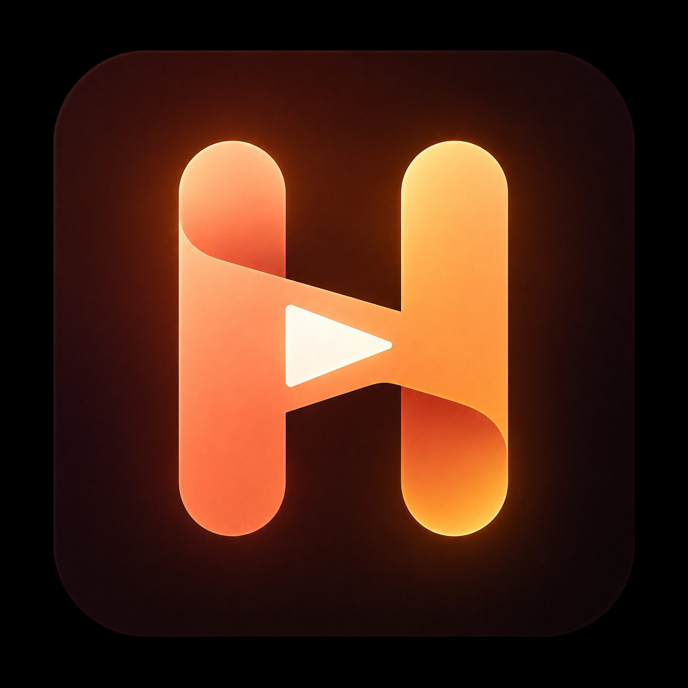

  
  <h1>HaizFlow</h1>
  
<strong>Ứng dụng miễn phí để tải, dịch, tạo phụ đề và lồng tiếng video trên Windows.</strong>

  
<a href="https://github.com/MachHongHai/HaizFlow/releases/download/v0.1.7/HaizFlow-0.1.7-Setup.exe">Cài đặt</a> · <a href="docs/user-guide.vi.md">Hướng dẫn sử dụng</a> · <a href="docs/support.vi.md">Trợ giúp</a> · <a href="README.md">English</a>

## Giới thiệu

HaizFlow giúp bạn tải video, dịch nội dung, tạo phụ đề và lồng tiếng. Bạn có thể xử lý từng video hoặc hàng loạt, che phụ đề gốc và tạo giọng đọc cho video có nhiều người nói. Video sau khi xử lý có thể đăng lên mạng xã hội qua Zernio.

Ứng dụng có chế độ Tự động để chạy các bước bạn đã chọn và trình sửa Thủ công để kiểm tra, chỉnh lại phụ đề hoặc giọng đọc trước khi xuất video.

## Chức năng chính

| Chức năng | Bạn có thể làm gì? |
| --- | --- |
| **Tải video hàng loạt** | Chọn nhiều video từ kênh hoặc trang cá nhân công khai được hỗ trợ và tải theo hàng đợi. |
| **Dịch video** | Nhận dạng lời nói bằng Whisper; dịch bằng HY-MT2 trên máy hoặc Gemini. Sửa bản dịch trước khi xuất. |
| **Tạo phụ đề** | Tạo phụ đề từ lời nói trong video; chỉnh nội dung, thời gian, kiểu chữ Bangers và hiệu ứng karaoke. |
| **Lồng tiếng** | Tạo giọng đọc cho nội dung đã dịch, chọn giọng có sẵn hoặc dùng mẫu giọng bạn có quyền sử dụng. |
| **Xử lý tự động** | Chọn ngôn ngữ, model và giọng đọc, rồi để ứng dụng chạy các bước nhận dạng, dịch, tạo giọng và che phụ đề đã chọn. |
| **Xử lý hàng loạt** | Áp dụng thiết lập chung cho nhiều video, theo dõi tiến trình và kết quả của từng video. |
| **Che phụ đề gốc** | Dùng OCR tìm vùng phụ đề, sau đó làm mờ hoặc vá nền để che chữ gốc. |
| **Nhận diện nhiều người nói** | Phân nhóm người nói trong video và gán giọng đọc riêng cho từng nhóm, thay vì dùng một giọng cho cả hội thoại. |
| **Đăng mạng xã hội** | Chọn tài khoản, chuẩn bị nội dung và đăng video qua Zernio. Có thể lấy video đã xử lý trực tiếp từ dự án. |

Các công cụ trong trình sửa Thủ công chạy độc lập: không bắt buộc lồng tiếng nếu bạn chỉ cần video có phụ đề dịch.

Xem trước video, chỉnh phụ đề và chọn giọng đọc phù hợp trước khi xuất hoặc đăng.

## Dịch trên máy, không cần trả phí API theo lượt

Whisper và HY-MT2 chạy trên máy sau khi cài gói tài nguyên, không cần API key hoặc phí dịch theo lượt gọi. Gemini là lựa chọn thêm nếu bạn muốn dùng dịch vụ trực tuyến.

Máy không có GPU NVIDIA vẫn dùng được các lựa chọn CPU. Với GPU NVIDIA tương thích, bạn có thể chọn các model GPU. Chọn chế độ trong Cài đặt và cài các gói tương ứng với công cụ bạn muốn dùng.

Gemini, Zernio và các dịch vụ bên ngoài có điều khoản, hạn mức và chi phí riêng. Giọng OmniVoice có giới hạn sử dụng nêu ở phần giấy phép bên dưới.

## Cài đặt và bắt đầu

**[Tải bộ cài Windows](https://github.com/MachHongHai/HaizFlow/releases/download/v0.1.7/HaizFlow-0.1.7-Setup.exe).** Chỉ mở file EXE này; không cần tải hoặc giải nén các tệp Core. Gói tài nguyên được cài trong HaizFlow. [Thông tin phiên bản và cài đặt](https://github.com/MachHongHai/HaizFlow/releases/latest).

1. Cài và mở HaizFlow. Giao diện mặc định là tiếng Việt.
2. Chọn CPU hoặc GPU NVIDIA trong **Cài đặt → Chung** và cài các gói cần dùng trong **Gói tài nguyên**.
3. Tạo dự án **Tự động**, **Thủ công** hoặc **Hàng loạt**, rồi thêm video.
4. Chọn ngôn ngữ, model và giọng đọc nếu cần. Chạy xử lý, kiểm tra kết quả rồi **Xuất** video.

Ứng dụng hỗ trợ Windows 10 phiên bản 1809 trở lên và Windows 11 x64, RAM hệ thống từ 16 GB. Không cần cài Python khi dùng bộ cài. Cần thêm dung lượng cho gói tài nguyên, video và tệp xuất; bộ cài và trang Gói tài nguyên hiển thị yêu cầu tương ứng.

Chế độ GPU hỗ trợ card NVIDIA 6 GB trở lên. Với card 6 GB, ưu tiên Demucs, Whisper Small và dịch bằng Gemini hoặc HY-MT2 CPU Q4. Bản chưa ký số có thể bị Windows Smart App Control hoặc chính sách Application Control chặn; xem [hướng dẫn cài đặt](docs/install.vi.md).

Xem [hướng dẫn cài đặt](docs/install.vi.md) để chọn gói CPU/GPU, thêm API key và chọn vị trí lưu dữ liệu. Xem [hướng dẫn sử dụng](docs/user-guide.vi.md) để tạo dự án, chỉnh phụ đề, lồng tiếng và đăng bài.

## Giấy phép và sử dụng thương mại

HaizFlow miễn phí sử dụng theo [HaizFlow Source-Available 1.0](LICENSE). Đây không phải giấy phép nguồn mở OSI; điều kiện phân phối lại, đóng gói lại và kinh doanh phần mềm được quy định trong LICENSE.

**Model OmniVoice hiện tại chỉ được cấp phép cho mục đích phi thương mại.** Không mặc định dùng model này cho quảng cáo, video kiếm tiền hoặc công việc khách hàng khi chưa có quyền phù hợp. Giấy phép của HaizFlow không thay thế giấy phép model.

Bạn cần có quyền sử dụng video, nhạc và mẫu giọng được đưa vào ứng dụng. Xem [NOTICE](NOTICE) và [thông báo thành phần bên thứ ba](THIRD_PARTY_NOTICES.md). [Hồ sơ giấy phép](docs/licensing-review.md) và [dự thảo không có hiệu lực](legal/LICENSE-SOURCE-AVAILABLE-DRAFT.md) được lưu riêng.

Ứng dụng dùng Qt/PySide theo LGPL và FFmpeg theo GPL/LGPL, tùy thành phần. [Nguồn thư viện đi kèm](https://github.com/MachHongHai/HaizFlow/releases/download/v0.1.7/HaizFlow-0.1.7-ThirdPartySources.zip) và [hướng dẫn thay thư viện](docs/third-party-library-replacement.md) được cung cấp riêng; quyền theo giấy phép của các thư viện vẫn được giữ nguyên.

## Hỗ trợ và đóng góp

Xem [Trợ giúp](docs/support.vi.md) để quản lý tài nguyên, API key và dữ liệu. Bạn cũng có thể [gửi góp ý hoặc yêu cầu hỗ trợ](https://github.com/MachHongHai/HaizFlow/issues). Không gửi API key hoặc dữ liệu riêng tư.

Phần cài đặt từ mã nguồn, kiểm thử và đóng gói nằm trong [hướng dẫn phát triển](docs/development.vi.md). Xem [tài liệu kỹ thuật](docs/README.vi.md) nếu bạn muốn đóng góp mã.

HaizFlow do **Mạch Hồng Hải** phát triển. Bạn có thể [đánh dấu sao repository](https://github.com/MachHongHai/HaizFlow) để theo dõi dự án.
